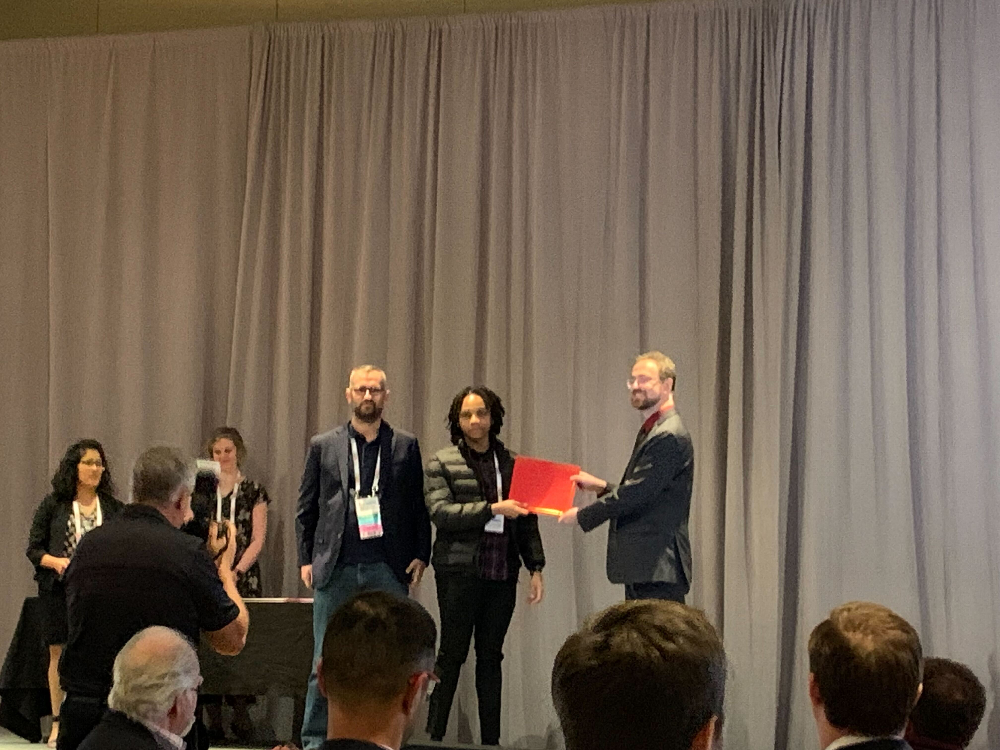
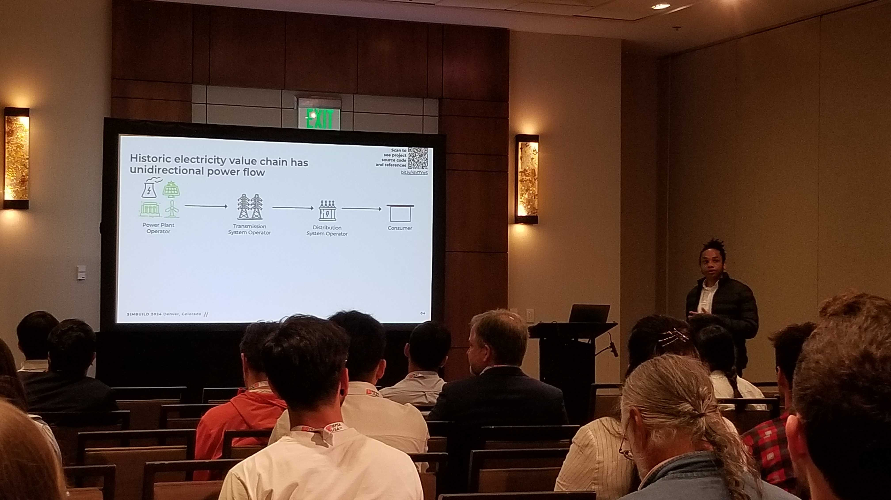
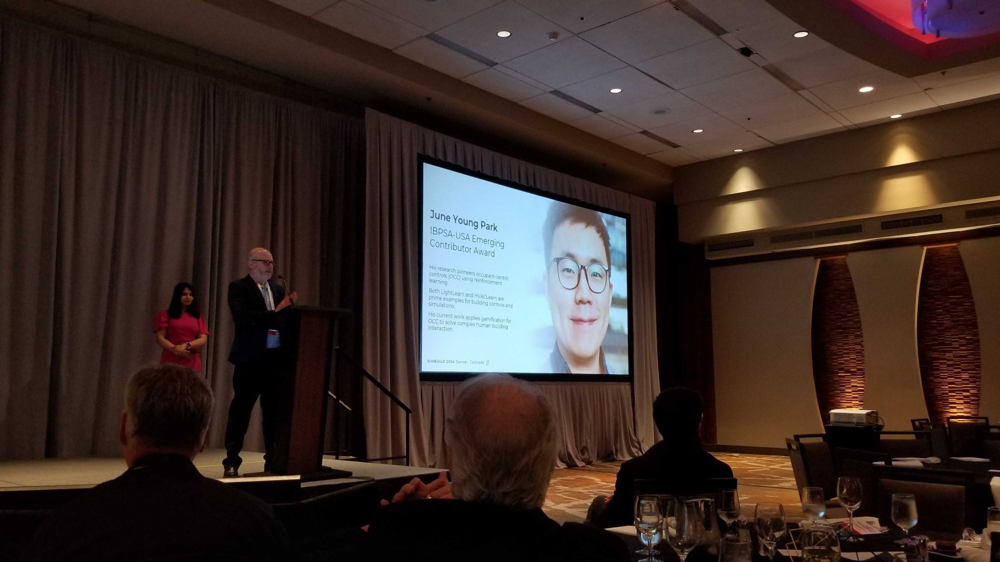
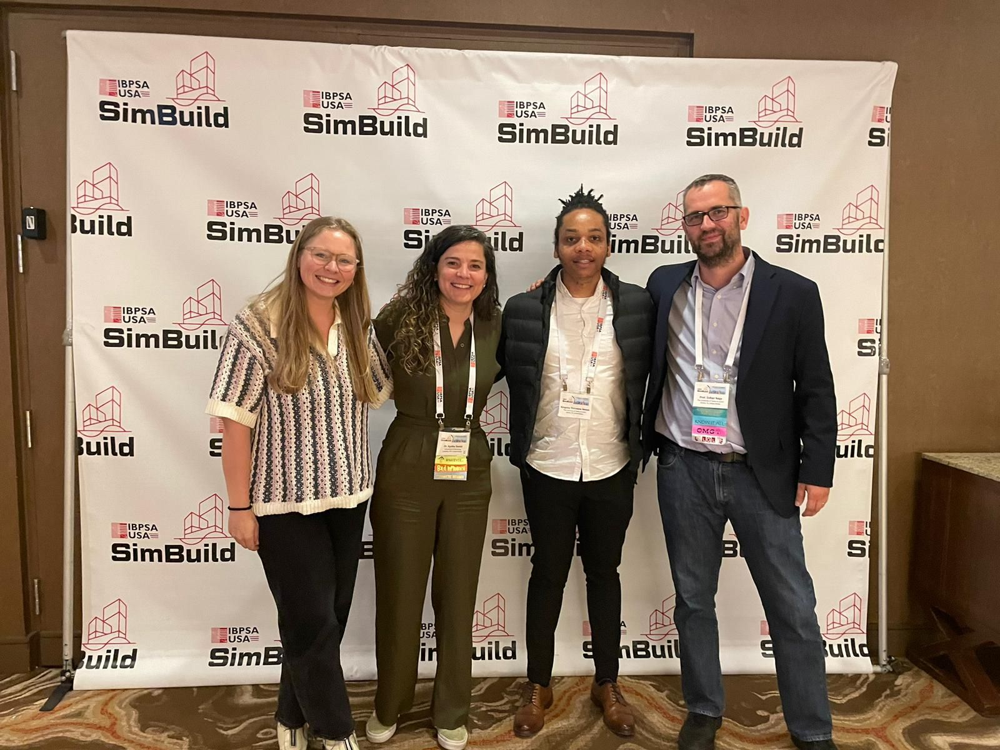
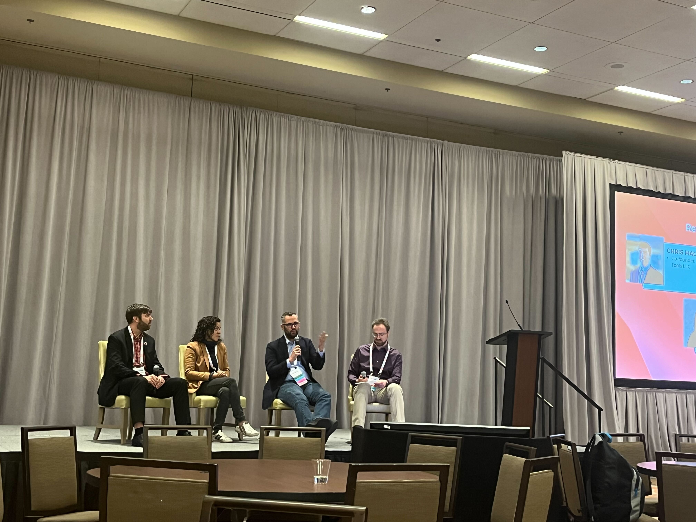

Our amazing PhD researcher Kingsley, received the Best Student Paper Award at Simbuild24 in Denver for his paper: *Applications in CityLearn Gym Environment for Multi-Objective Control Benchmarking in Grid-Interactive Buildings and Districts*

Our alumnus Dr June Park received the IBPSA-USA *Emerging Contributor Award*!!

Dr Nagy received the webinar award!

