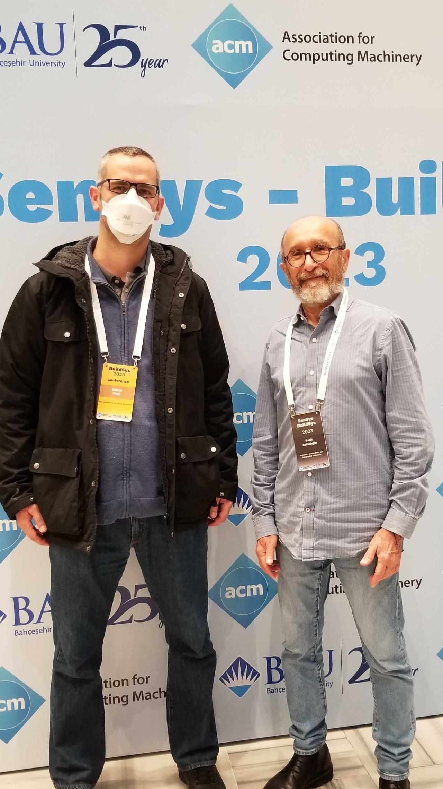
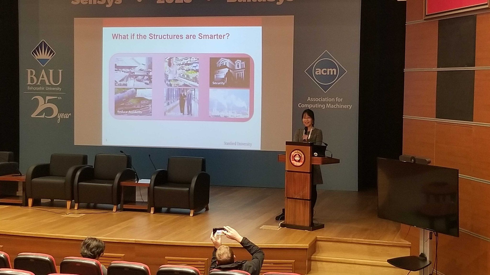
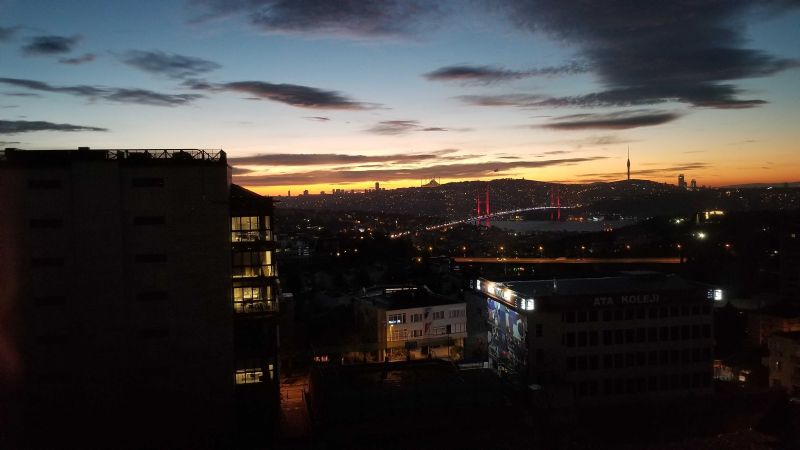
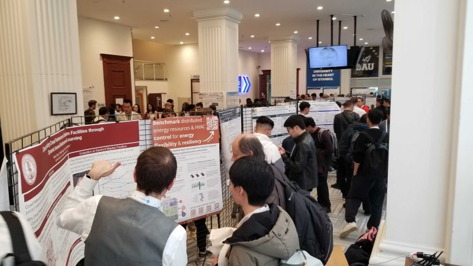

📢 We had great hashtag#ACM hashtag#BuildSys23 conference last week in Istanbul, celebrating a decade of research on sustainable built environment at the intersection of the computer science and the building engineering community!! Dr Nagy had the privilege to chair this wonderful conference. 

Antonio Ruzzelli delivered a thrilling keynote on the ups and downs of his startup journey and its parallels to the BuildSys community.

Haeyoung Noh talked about the use of structure as sensors in her keynote, and the practical implications for long term research projects.

Panelists Dan Wang, Burak Gunay, Antonio Ruzzelli and David Irwin discussed the Past, Present and Future of the BuildSys community, moderated by Mario Bergés. 

A poster session (both in-person and virtual), a banquet, six workshops, a PhD Forum, as well as many good discussion in-between the high quality research presentations made hashtag#BuildSys23 a big success, and a venue I enjoy returning to. Check out the papers and poster abstracts on ACM DL: https://lnkd.in/gcw22SJg

Being an interdisciplinary community, BuildSys is uniquely positioned to address the great societal challenge of decarbonizing the built environment and I look forward to what the future holds!

I thank the entire BuildSys organizing committee for putting this event together, it was a pleasure working with you all! 

Clayton Miller Rajesh Gupta Bharathan Balaji Javad Mohammadi June Young Park Matias Quintana Noman Bashir Kingsley Nweye Omid Ardakanian Hari Prasanna Das Tong Wu Rui Tan Aysegul Demir Dilsiz Burak Gunay and of course local arrangements and SenSys-GC Rasit Eskicioglu .

