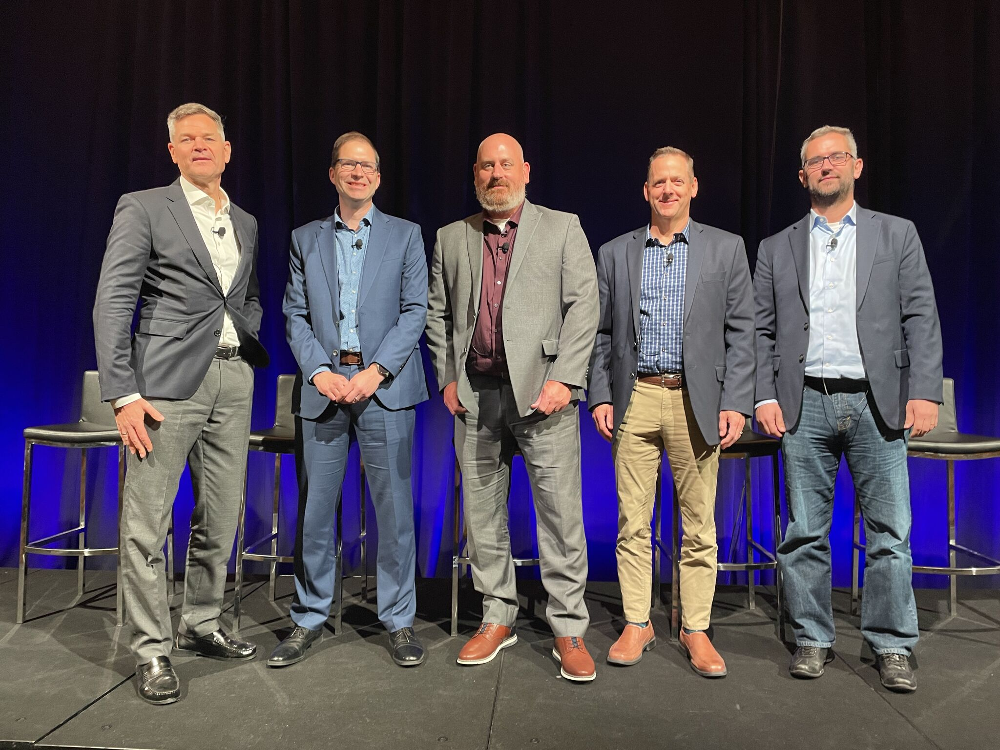
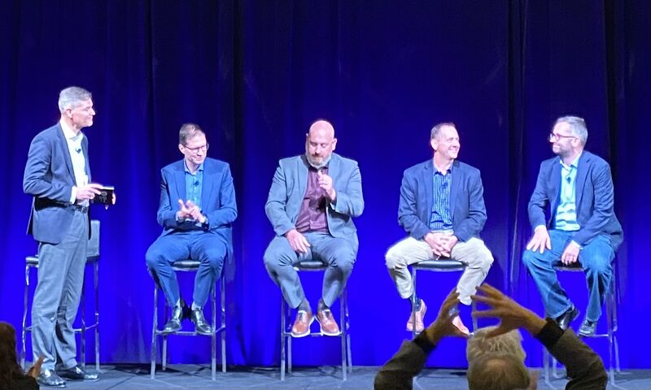

Great discussion led by Richard J. Vestner and panel Jamie Cudden, Blaine Buenger, Jerry Dehn and Zoltan Nagy on how digital twins are helping city leaders and their supply chains collaborate and make informed, data-driven decisions to improve urban living.

Catch it again here (free registration required): https://www.bentley.com/yii/registration/

