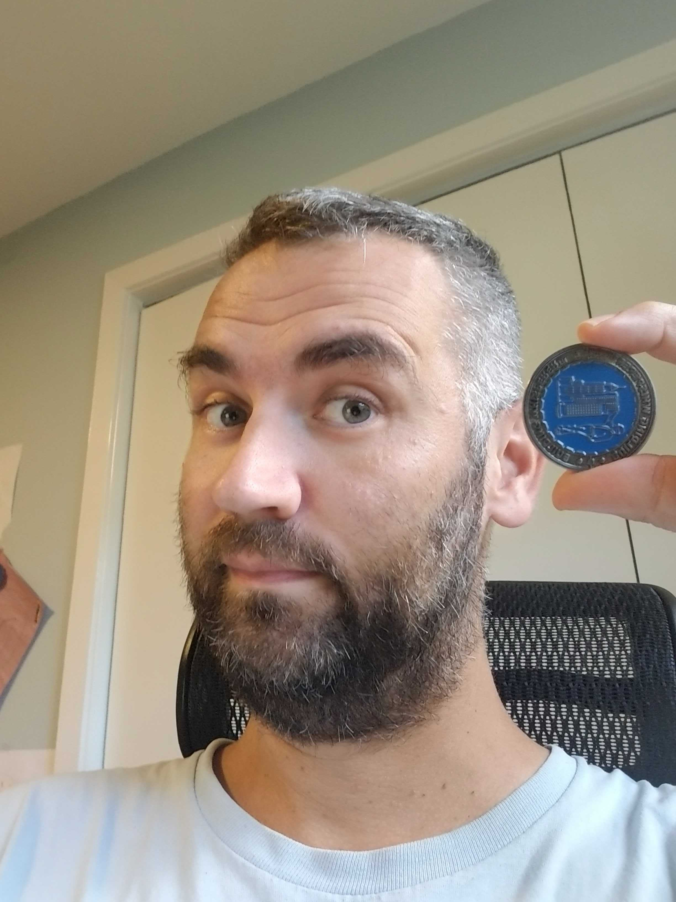

Dr Nagy was honored with the "operationally ready" challenge coin by the Edifice Complex Podcast. The coins are only given to professionals who are alumni of the podcast and know the difference between 'substantial completion' and 'building operational readiness'.

Dr Nagy was the #5 episode of the podcast, discussing the gap between energy and comfort: https://edificecomplexpodcast.com/episodes/005-dr-zoltan-nagy-the-gap-between-energy-thermal-comfort/

