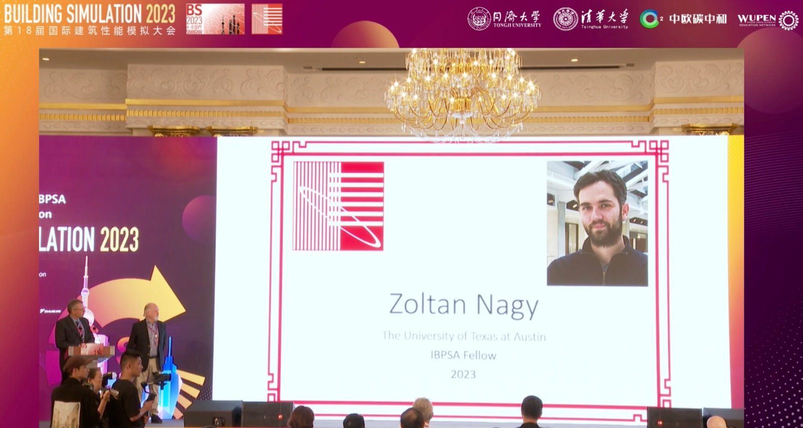

During the 2023 Building Simulation conference, Dr Nagy was named IBPSA Fellow for 

“The grade of IBPSA fellow is awarded to members who have attained distinction in the field of building performance simulation (or in the allied arts or sciences), by either the teaching of major courses in said arts and sciences, or by way of research, simulation code development, original work, or the application of building simulation on projects of a significant scope. The individual must have been active in the field for at least ten years.”

https://bs2023.org/awards#

