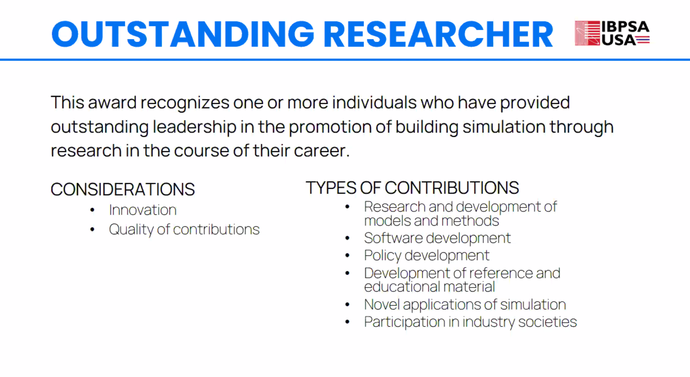

This award recognizes one or more individuals who have provided outstanding leadership in the promotion of building simulation through research in the course of their career.

The award has be announced at the [2022 ASHRAE/IBPSA-USA BPAC/SimBuild Conference .](https://www.ashrae.org/conferences/topical-conferences/2022-building-performance-analysis-conference-and-simbuild)

